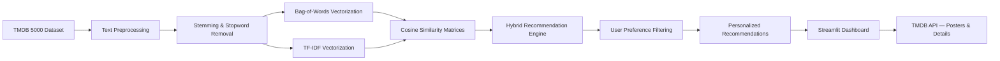
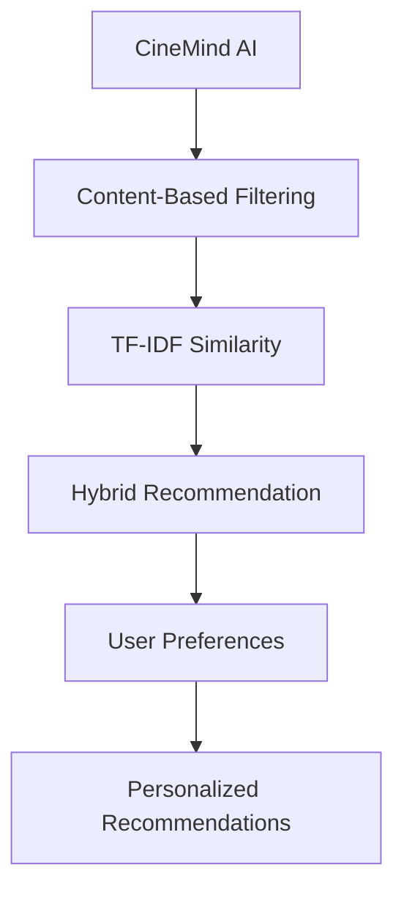

<div align="center">

# CineMind AI

**Personalized Hybrid Movie Recommendation Engine**

[](https://python.org)
[](https://streamlit.io)
[](https://scikit-learn.org)
[](https://pandas.pydata.org)
[](https://www.themoviedb.org)

</div>

---

# Overview

**CineMind AI** is an end-to-end **NLP and machine learning** application that delivers personalized movie recommendations using content-based filtering, Bag-of-Words, TF-IDF similarity, hybrid ranking, and user preference filtering.

The system processes the TMDB 5000 dataset, extracts movie metadata such as genres, keywords, cast, crew, and overview, and generates multiple similarity signals. These signals are combined through a hybrid recommendation engine and refined using user preferences such as favorite genres, preferred decade, and minimum rating.

---

# Features

| Feature | Description |
|----------|-------------|
| **Content-Based Recommendations** | Recommends similar movies based on tags, genres, keywords, cast, and production company. |
| **TF-IDF Similarity** | Uses TF-IDF vectorization to reduce the influence of common terms and improve text-based similarity. |
| **Hybrid Recommendation** | Blends content-based (BoW) and semantic (TF-IDF) scores with a configurable weight slider. |
| **User Preferences** | Set favorite genres, preferred decade range, and minimum rating to personalize results. |
| **Personalized For You** | Generates recommendations based on the selected movie and user preferences. |
| **Multi-Criteria Similarity** | Five independent similarity matrices allow comparison from different angles. |
| **Movie Details Dashboard** | Displays overview, budget, revenue, runtime, rating, genres, languages, and director. |
| **Live Poster & Backdrop Art** | Fetches high-resolution images from the TMDB API in real time. |
| **Cast Biographies** | Shows top-5 cast photos with expandable biographies pulled from TMDB. |
| **Full Movie Browser** | Paginated gallery of all ~4,800 movies with search and rating overlays. |
| **Dark-Themed UI** | Cinema-inspired dark theme with hero banners, pill chips, and hover animations. |

---

# Architecture



---

# Tech Stack

| Category | Technologies |
|----------|--------------|
| Language | Python |
| Frontend | Streamlit, HTML5, CSS3 |
| NLP | NLTK (PorterStemmer, Stopwords) |
| Machine Learning | scikit-learn (CountVectorizer, TfidfVectorizer, Cosine Similarity) |
| Data Processing | Pandas, NumPy |
| API | TMDB (The Movie Database) REST API |
| Serialization | Pickle |
| Theme | Custom dark theme with CSS injection |

---

# Project Structure

```text
CineMind-AI/
│
├── main.py                          # Streamlit application entry point
├── requirements.txt                 # Python dependencies
├── README.md
├── .gitignore
│
├── processing/
│   ├── __init__.py
│   ├── preprocess.py                # Data loading, NLP pipeline, TMDB API helpers
│   ├── display.py                   # Similarity matrix generation and caching
│   ├── ui.py                        # Theme CSS, hero banners, chip components
│   ├── embeddings.py                # TF-IDF semantic embeddings and similarity
│   ├── preferences.py               # User preference management and filtering
│   └── hybrid.py                    # Hybrid recommendation engine (BoW + TF-IDF blend)
│
├── Files/
│   ├── tmdb_5000_movies.csv         # Raw movie metadata
│   ├── tmdb_5000_credits.csv        # Raw cast & crew data
│   ├── new_df_dict.pkl              # Processed movie DataFrame (generated)
│   ├── movies_dict.pkl              # Full movie DataFrame (generated)
│   ├── movies2_dict.pkl             # Metadata DataFrame (generated)
│   ├── similarity_tags_tags.pkl     # Overall tag similarity (generated)
│   ├── similarity_tags_genres.pkl   # Genre similarity (generated)
│   ├── similarity_tags_keywords.pkl # Keyword similarity (generated)
│   ├── similarity_tags_cast.pkl     # Cast similarity (generated)
│   ├── similarity_tags_production_comp.pkl  # Production company similarity (generated)
│   └── similarity_tfidf.pkl         # TF-IDF semantic similarity (generated)
│
└── .streamlit/
    ├── config.toml                  # Dark theme & server configuration
    └── secrets.toml.example         # TMDB API key template
```

---

# Quick Start

## Prerequisites

- Python 3.10+
- A free TMDB API key ([get one here](https://www.themoviedb.org/settings/api))

---

## Installation

Clone the repository

```bash
git clone https://github.com/YOUR_USERNAME/CineMind-AI.git

cd CineMind-AI
```

Create a virtual environment (recommended)

```bash
python -m venv venv
source venv/bin/activate        # macOS / Linux
venv\Scripts\activate           # Windows
```

Install dependencies

```bash
pip install -r requirements.txt
```

---

## Configure API Key

Copy the secrets template and add your TMDB API key

```bash
cp .streamlit/secrets.toml.example .streamlit/secrets.toml
```

Edit `.streamlit/secrets.toml` and replace the placeholder

```toml
TMDB_API_KEY = "your-tmdb-api-key"
```

---

## Run

```bash
streamlit run main.py
```

Open

```
http://localhost:8501
```

> **Note:** The first run may take a few minutes as it preprocesses the dataset and generates similarity matrices (~400 MB of pickle files).

---

# Recommendation Pipeline

```text
TMDB Dataset
      │
      ▼
Data Preprocessing
      │
      ▼
Feature Extraction
      │
 ┌────┴─────┐
 ▼          ▼
BoW        TF-IDF
 │          │
 ▼          ▼
Cosine     Cosine
Similarity Similarity
 └────┬─────┘
      │
      ▼
Hybrid Recommendation
      │
      ▼
User Preference Filtering
      │
      ▼
Personalized Ranking
      │
      ▼
Top-N Recommendations
```

---

# Content-Based Pipeline

```text
Movie Metadata
      │
      ▼
CountVectorizer
      │
      ▼
Cosine Similarity
      │
      ▼
Content-Based Recommendations
```

---

# Model Workflow

1. User selects a movie.

2. CineMind AI extracts movie features including
   overview, genres, keywords, cast, crew, and
   production companies.

3. Bag-of-Words and TF-IDF representations are generated.

4. Cosine similarity is calculated for both representations.

5. The hybrid recommendation engine combines the
   similarity scores using configurable weights.

6. User preferences are applied:
   - Favorite genres
   - Preferred decade
   - Minimum rating

7. Movies are ranked using the final personalized score.

8. The highest-ranked movies are displayed with
   posters, ratings, release information, and movie
   details fetched from TMDB.

---

# App Pages

| Page | Description |
|------|-------------|
| **Recommend** | Select a movie and receive recommendations across multiple similarity criteria. |
| **For You** | Get personalized recommendations based on hybrid similarity and user preferences. |
| **Details** | Explore movie overview, ratings, runtime, budget, revenue, genres, languages, director, and cast biographies. |
| **All Movies** | Browse, search, and explore the complete movie collection. |

---

# Similarity Dimensions

| Dimension | What It Compares |
|-----------|-----------------|
| **Overall (Tags)** | Combined movie metadata including overview, genres, keywords, cast, and crew. |
| **Genres** | Similarity based on movie genres. |
| **Keywords** | Similarity based on plot-related keywords. |
| **Cast** | Similarity based on shared actors. |
| **Production Company** | Similarity based on production studios. |
| **TF-IDF** | Weighted textual similarity that reduces the influence of common terms. |
| **Hybrid** | Combines BoW and TF-IDF similarity into a unified recommendation score. |

---

# Applications

- Personalized Movie Suggestions
- Content Discovery Platforms
- Streaming Service Recommendations
- Film Database Exploration
- NLP & ML Learning Projects
- Content-Based Filtering Research
- Entertainment Analytics Dashboards

---

# Future Improvements

- Collaborative Filtering (user-based & item-based)
- Transformer-based embeddings (BERT/Sentence-BERT)
- User authentication and watch history
- REST API deployment with FastAPI
- Docker containerization
- Cloud deployment (Streamlit Cloud, AWS, GCP)
- Real-time trending movie integration
- Multi-language support

---

# Evolution Roadmap



```text
CineMind AI
      │
      ▼
Content-Based Filtering
      │
      ▼
TF-IDF Similarity
      │
      ▼
Hybrid Recommendation
      │
      ▼
User Preferences
      │
      ▼
Personalized Recommendations
```

---

# License

This project is intended for educational and research purposes.

---

<div align="center">

<sub>Built using Python, Streamlit, scikit-learn, NLTK, Pandas, and the TMDB API.</sub>

</div>
